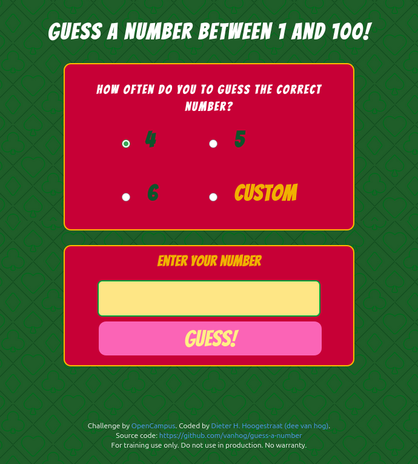

# Guess a number

**For training use only. Do not use in production. No warranty.**

This is a solution to the [OpenCampus WebDev Program 2025's ](https://edu.opencampus.sh/en) "Guess a number" challenge.

## Table of contents

- [Task](#Taks)
- [Screenshot](#screenshot)
- [Links](#links)
- [Built with](#built-with)
- [Author](#author)

## Task

- Design a game in which players have to guess a number between 1 and 100.
- Players can also choose how many attempts they need to find the correct number.
- The design can be super simple.

## Screenshot

## Links

- Solution URL:[https://github.com/vanhog/guess-a-number](https://github.com/vanhog/guess-a-number)
- Live Site URL: [https://guess-a-number-training-project.netlify.app/](https://guess-a-number-training-project.netlify.app/)

## Built with

- Semantic HTML5 markup
- CSS custom properties
- Tailwindcss
- Flexbox
- CSS Grid
- Mobile-first workflow

## Acknowledgements

The poker table background is a freely available image from: https://www.freepik.com/free-photos-vectors/casino-concept-background

## Author

- Website - [Dieter H. Hoogestraat (dee van hog)](https://www.hoogestraat.com)
- Github - [@vanhog](https://github.com/vanhog)
